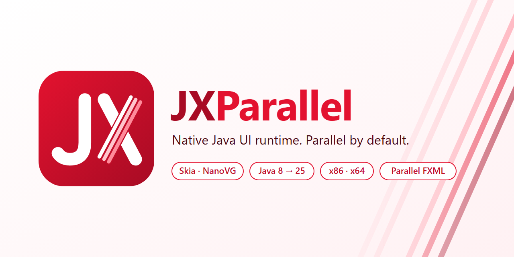
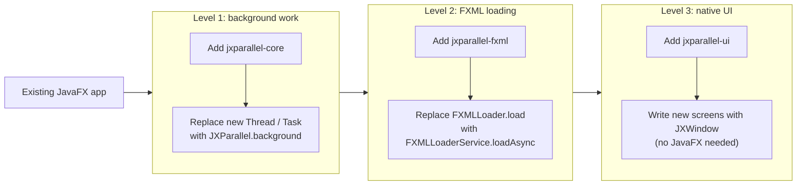
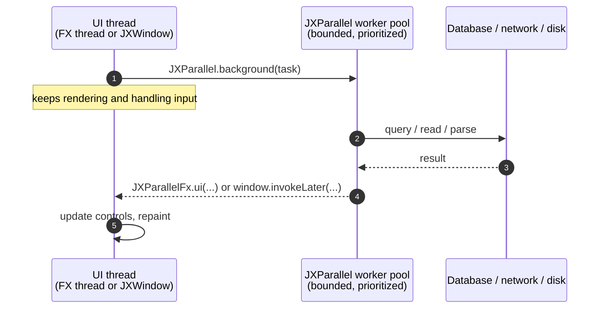
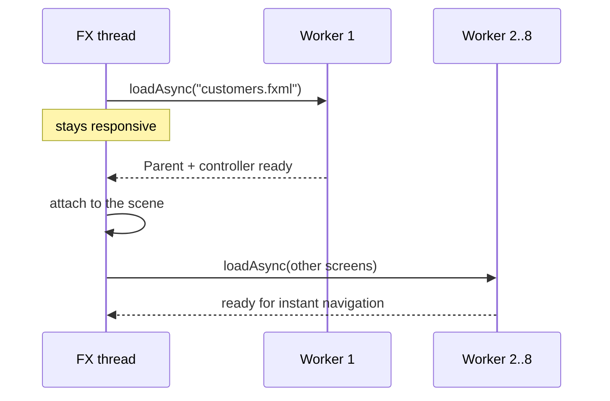
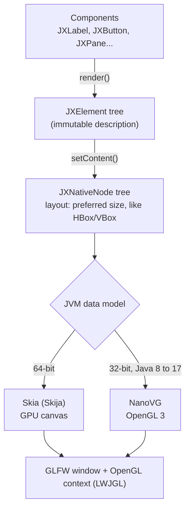
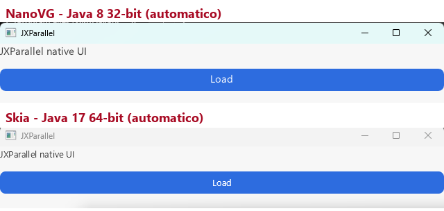
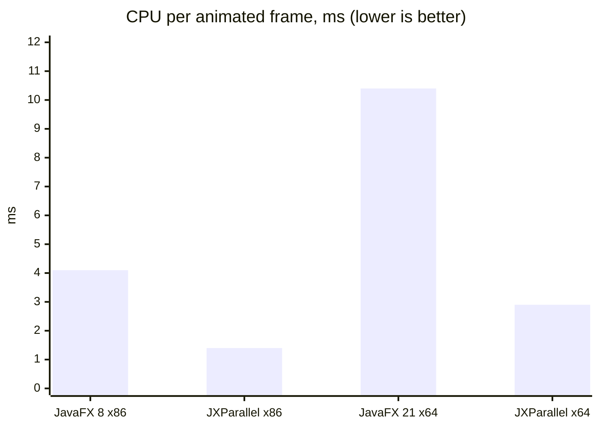
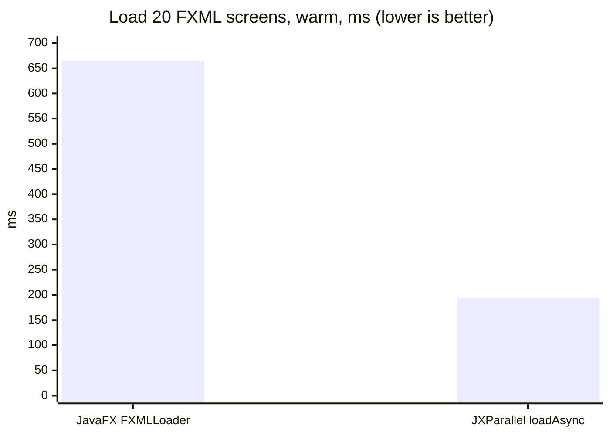

<p align="center">
  
</p>

<p align="center">
  <a href="https://github.com/Bacuriim/JXParallel/actions/workflows/build.yml"></a>
  
  
  <a href="LICENSE"></a>
</p>

**JXParallel** is a Java UI runtime for applications that outgrew the single JavaFX
Application Thread. You can adopt it one step at a time: keep your JavaFX application and move
background work and FXML loading onto a bounded worker pool, or write new screens on the
native JXParallel UI, which draws with Skia or NanoVG on OpenGL and does not depend on JavaFX.

| Measured against JavaFX (medians of 5 runs, [details](#performance)) | JavaFX | JXParallel |
|---|---:|---:|
| Load 20 FXML screens with controllers (warm) | 665 ms | **194 ms** |
| FX thread blocked while loading those screens (cold) | 1163 ms | **0 ms** |
| CPU per frame, 600 animated frames, Java 17 x64 | 10.4 ms | **2.9 ms** |
| CPU per frame, 600 animated frames, Java 8 x86 | 4.1 ms | **1.4 ms** |
| Peak RAM of the same UI test, Java 17 x64 | 249.9 MB | **154.2 MB** |

> **Status: pre-1.0.** The scheduler, properties, events and FXML loading are tested and usable.
> The native UI covers basic controls and layouts; CSS, virtualized lists and tables, and full
> accessibility are not implemented yet. See [project status](#project-status).

## Contents

- [Why JXParallel](#why-jxparallel)
- [Adopting it step by step](#adopting-it-step-by-step)
- [JavaFX vs JXParallel, side by side](#javafx-vs-jxparallel-side-by-side)
- [How it works](#how-it-works)
- [Performance](#performance)
- [Installation](#installation)
- [Configuration](#configuration)
- [Platform support](#platform-support)
- [Modules](#modules)
- [Project status](#project-status)
- [Documentation](#documentation)

## Why JXParallel

Large JavaFX applications tend to hit the same three limits:

| Problem in JavaFX | What JXParallel does |
|---|---|
| Every `FXMLLoader.load` runs on the FX thread, so opening a module with many screens freezes the UI. | Loads FXML views and controllers on a worker pool, in parallel, while the FX thread keeps painting. |
| Background work means `new Thread(task)` or an unbounded executor per feature; under load, threads and queues grow without limit. | One bounded, prioritized worker pool with explicit backpressure (`BLOCK`, `REJECT`, `DISCARD`, `DISCARD_OLDEST`), timeouts and cancellation. |
| The scene graph, CSS engine and skins cost memory and CPU on every frame, and the toolkit is tied to the JavaFX release you can ship. | A native scene graph drawn with Skia (64-bit) or NanoVG (32-bit) on OpenGL, with fewer classes, less allocation and no JavaFX dependency. |

## Adopting it step by step

You do not need to rewrite anything to start. Each level is independent and can stay in place
for as long as you need.



| Level | What changes in your code | JavaFX still required |
|---|---|---|
| 1. Background work | One `JXParallel.start()` at startup and one `shutdownNow()` at exit. Each `Task` plus `new Thread` becomes `JXParallel.background(...)` plus `JXParallelFx.ui(...)`. Controllers, FXML and CSS stay the same. | Yes |
| 2. FXML loading | Each `FXMLLoader.load(url)` becomes `loader.loadAsync(path)` and the result is attached on the FX thread. FXML files and controllers stay the same. | Yes |
| 3. Native UI | New screens use `JXWindow` and the `com.jxparallel.ui` controls. Existing JavaFX screens keep working next to them. | No, for native screens |

## JavaFX vs JXParallel, side by side

### Level 1: background work in an existing JavaFX screen

The same "load, then update the label" action. The JavaFX version creates one thread per click;
the JXParallel version reuses the bounded pool. Taken from
[`TraditionalJavaFxApp`](jxparallel-examples/src/main/java/com/jxparallel/examples/TraditionalJavaFxApp.java)
and [`JXParallelJavaFxApp`](jxparallel-examples/src/main/java/com/jxparallel/examples/JXParallelJavaFxApp.java).

<table>
<tr><th>JavaFX</th><th>JXParallel</th></tr>
<tr>
<td>

```java
Task<String> task = new Task<String>() {
    @Override
    protected String call() throws Exception {
        return service.greet(name);
    }
};
task.setOnSucceeded(e -> {
    status.setText(task.getValue());
    button.setDisable(false);
});
task.setOnFailed(e -> {
    status.setText("Unable to complete");
    button.setDisable(false);
});
Thread worker = new Thread(task);
worker.setDaemon(true);
worker.start();
```

</td>
<td>

```java
JXParallel.background(() -> service.greet(name))
    .thenAccept(value -> JXParallelFx.ui(() -> {
        status.setText(value);
        button.setDisable(false);
    }))
    .exceptionally(error -> {
        JXParallelFx.ui(() -> {
            status.setText("Unable to complete");
            button.setDisable(false);
        });
        return null;
    });
```

</td>
</tr>
</table>

What you add once, in the `Application` class:

```diff
  public static void main(String[] args) {
+     JXParallel.start();
      launch(args);
  }

  @Override
  public void stop() {
+     JXParallel.shutdownNow();
  }
```

The rule for the rest of the code:

```text
I/O, parsing, computation   ->  JXParallel.background(...)
Scene graph changes         ->  JXParallelFx.ui(...)   (Platform.runLater semantics)
```

Timeouts, priorities and cancellation are available when you need them:

```java
Task.of(() -> remoteService.fetch())
    .withTimeout(5, TimeUnit.SECONDS)
    .withPriority(TaskPriority.HIGH)
    .submit()
    .thenAccept(result -> JXParallelFx.ui(() -> render(result)));
```

### Level 2: FXML loading in an existing application

Same FXML files, same controllers. Only the loading call changes.

<table>
<tr><th>JavaFX: loads on the FX thread, one after another</th><th>JXParallel: loads on the worker pool</th></tr>
<tr>
<td>

```java
// UI is frozen until every view is built
Parent customers = FXMLLoader.load(
    getClass().getResource("/views/customers.fxml"));
Parent orders = FXMLLoader.load(
    getClass().getResource("/views/orders.fxml"));
Parent reports = FXMLLoader.load(
    getClass().getResource("/views/reports.fxml"));

tabs.getTabs().get(0).setContent(customers);
```

</td>
<td>

```java
FXMLLoaderService loader = new FXMLLoaderService();

// 1. The screen the user opened, alone: ready first
loader.loadAsync("/views/customers.fxml")
    .thenAccept(view -> JXParallelFx.ui(
        () -> tabs.getTabs().get(0).setContent(view)));

// 2. The others, in parallel, in the background
loader.loadAsync("/views/orders.fxml");
loader.loadAsync("/views/reports.fxml");
```

</td>
</tr>
</table>

Load the screen the user is waiting for first, then preload the rest. Starting all of them at
once makes the first one compete for cores with the others; measured on 20 screens, the first
screen went from 72 ms to 59 ms warm (JavaFX: 64 ms) with this order, and the full set stayed
3.7x faster than sequential `FXMLLoader`.

### Level 3: a native screen, no JavaFX

For new modules. The model is component-based: you change state, then push the new tree to the
window.

<table>
<tr><th>JavaFX</th><th>JXParallel native</th></tr>
<tr>
<td>

```java
public class Editor extends Application {
    @Override
    public void start(Stage stage) {
        Label title = new Label("Customers");
        Button save = new Button("Save");
        save.setOnAction(e -> saveDocument());

        VBox root = new VBox(12, title, save);
        stage.setScene(new Scene(root));
        stage.show();
    }
}
```

</td>
<td>

```java
public class Editor {
    public static void main(String[] args) {
        JXLabel title = new JXLabel("Customers");
        JXButton save = new JXButton("Save");
        save.setOnAction(() -> saveDocument());

        JXPane root = new JXPane(12);
        root.add(title);
        root.add(save);

        JXWindow window = new JXWindow("Editor");
        window.setContent(root.render());
        window.show();
    }
}
```

</td>
</tr>
</table>

Updating the UI from background work:

```java
JXParallel.background(() -> repository.count())
    .thenAccept(count -> window.invokeLater(() -> {
        title.setText(count + " customers");
        window.setContent(root.render());
    }));
```

The window picks its renderer by itself: Skia on 64-bit JVMs, NanoVG on 32-bit JVMs.
`-Djx.renderer=skia|nanovg` forces one and `-Djx.monitor=N` opens the window on another monitor.

### Tests

```java
@ExtendWith(JXParallelJUnit5Extension.class)   // starts and stops the pool per test
class CustomerServiceTest { ... }
```

JUnit 4 (`JXParallelJUnit4Rule`), Mockito and PowerMock helpers are also available.

## How it works

### Threading model



The pool grows from `threads.min` up to `threads.max` under load and lets idle workers expire.
When the queue is full, the configured policy decides whether the caller waits, fails fast or
drops work, so a burst of requests cannot exhaust memory.

### Parallel FXML loading



`FXMLLoaderService` builds a new `Parent` and a new controller for every load. Views are never
shared between scene graphs.

### Native rendering



Skija publishes no 32-bit native libraries, so 32-bit JVMs use NanoVG. Both renderers draw the
same shapes, colors and sizes:

<p align="center"></p>

## Performance

All numbers: Windows 11, Intel Core i7-1255U (12 threads), each implementation in a fresh JVM,
5 runs alternating JavaFX and JXParallel, medians. Method, raw CSVs and limitations are in the
linked reports.

### UI stress: 4 components, 500 updates each, then 600 animated frames

| Metric | JavaFX 8 x86 | JXParallel NanoVG x86 | JavaFX 21 x64 | JXParallel Skia x64 |
|---|---:|---:|---:|---:|
| JVM start to first frame | 855 ms | **761 ms** | 1568 ms | **888 ms** |
| Peak working set | 97.4 MB | **89.5 MB** | 249.9 MB | **154.2 MB** |
| Heap live after GC | 7.6 MB | **2.1 MB** | 10.6 MB | **2.1 MB** |
| CPU per frame | 4.1 ms | **1.4 ms** | 10.4 ms | **2.9 ms** |
| Allocation over 600 frames | 24.5 MB | **3.5 MB** | 34.1 MB | **4.8 MB** |
| Worst frame | 31.1 ms | **23.6 ms** | 56.9 ms | **13.1 ms** |
| 500 label updates, warm | 2.57 ms | **0.93 ms** | 3.34 ms | **2.59 ms** |
| 500 label updates, cold JIT | 11.4 ms | **10.3 ms** | **10.3 ms** | 10.7 ms |
| Frames per second | 118.3 | 119.3 | 118.4 | 120.3 |



x86 columns: 10 runs; x64: 5 runs; after the incremental-update changes. "Cold JIT" is the
first update phase of each run. Report: [ui-comparison-2026-09-25.md](docs/ui-comparison-2026-09-25.md).

### FXML: 20 form screens with controllers

| Metric | JavaFX `FXMLLoader` | JXParallel `FXMLLoaderService` |
|---|---:|---:|
| 20 screens, cold JVM | 1163 ms | **725 ms** |
| 20 screens, warm | 665 ms | **194 ms** |
| FX thread blocked (cold) | 1163 ms | **0 ms** |
| Peak working set | **319 MB** | 395 MB |



Report: [fxml-load-comparison.md](docs/fxml-load-comparison.md).

### Where JXParallel is not ahead yet

- **JavaFX draws more.** CSS, skins, LCD text and a real `ListView` cost JavaFX memory and CPU
  that the native renderer does not spend yet. Part of every gap above comes from that.
- **Parallel FXML loading peaks higher in memory** (+24%) because several screens are built at
  the same time.
- **The FXML cache stores file bytes**, which does not speed up loading; the cost is XML parsing
  and reflection. A pre-parsed template cache is planned.

<details>
<summary>Scheduler micro-benchmark and earlier measurements</summary>

`RuntimeComparisonRunner` compares the adaptive pool with `ForkJoinPool.commonPool()`
(Java 17, same machine):

| Scenario | Implementation | Iterations | Total time | Heap delta |
|---|---|---:|---:|---:|
| Sequential | `ForkJoinPool` | 1,000 | **29.7 ms** | 462 KB |
| Sequential | JXParallel pool | 1,000 | 57.1 ms | **250 KB** |
| Burst | `ForkJoinPool` | 64 | **36.3 ms** | 287 KB |
| Burst | JXParallel pool | 64 | 48.5 ms | **77 KB** |

`ForkJoinPool` dispatches trivial tasks faster; the bounded pool trades microseconds for
backpressure, priorities and lower allocation.

```powershell
mvn -pl jxparallel-benchmarks,jxparallel-core -am compile
java -cp "jxparallel-benchmarks\target\classes;jxparallel-core\target\classes" com.jxparallel.benchmarks.RuntimeComparisonRunner
```

Earlier reports (2026-09-22, when the native side drew into an AWT window):
[UI performance](docs/ui-performance-2026-09-22.md),
[Java 8 32-bit](docs/java8-32bit-comparison.md),
[methodology](docs/ui-performance-measurement.md).
The first UI stress report from that day was withdrawn: its native runner never pushed changes
to the renderer. See the [development log](docs/tcc/diario-de-desenvolvimento.md).

</details>

## Installation

JXParallel is not on Maven Central yet. Build and install it locally:

```powershell
git clone https://github.com/Bacuriim/JXParallel.git
cd JXParallel
mvn install -DskipTests
```

Then add the modules you need:

```xml
<!-- Level 1: worker pool, tasks, properties, events -->
<dependency>
    <groupId>com.jxparallel</groupId>
    <artifactId>jxparallel-core</artifactId>
    <version>0.1.0-SNAPSHOT</version>
</dependency>

<!-- Level 1 and 2 in a JavaFX app: FX dispatch, parallel FXML (build with -Plegacy-javafx) -->
<dependency>
    <groupId>com.jxparallel</groupId>
    <artifactId>jxparallel-fxml</artifactId>
    <version>0.1.0-SNAPSHOT</version>
</dependency>

<!-- Level 3: native UI, no JavaFX -->
<dependency>
    <groupId>com.jxparallel</groupId>
    <artifactId>jxparallel-ui</artifactId>
    <version>0.1.0-SNAPSHOT</version>
</dependency>
```

`jxparallel-ui` brings the LWJGL natives for the platform Maven runs on (Windows x64/x86,
Linux x64) and Skija on 64-bit.

## Configuration

In code:

```java
JXParallel.applyConfiguration(JXParallelConfig.builder()
    .minThreads(2)
    .maxThreads(8)
    .autoScale(true)
    .queueCapacity(500)
    .queuePolicy(QueuePolicy.BLOCK)
    .build());
```

Or in `jx-parallel.config` next to the application:

```properties
threads.min=2
threads.max=8
threads.auto-scale=true
queue.capacity=500
queue.policy=BLOCK
fxml.cache.enabled=true
fxml.cache.strategy=LRU
```

Precedence, lowest to highest: built-in defaults, `jx-parallel.config`, environment variables,
Java system properties (`-Dthreads.max=12`), programmatic configuration.

| Queue policy | When the queue is full |
|---|---|
| `BLOCK` | the caller waits for a free slot |
| `REJECT` | the returned future fails with `RejectedExecutionException` |
| `DISCARD` | the new task is cancelled without running |
| `DISCARD_OLDEST` | the oldest queued task is cancelled to make room |

Full reference: [configuration.md](docs/configuration.md).

## Platform support

| JVM | Architecture | Native UI renderer | Window opened and measured | CI (unit tests) |
|---|---|---|---|---|
| Java 8 | x86 | NanoVG | yes | Windows, core and UI |
| Java 8 | x64 | Skia | not yet | Ubuntu, core |
| Java 11 | x64 | Skia | not yet | Ubuntu |
| Java 17 | x64 | Skia | yes | Ubuntu, Windows |
| Java 17 | x86 | NanoVG | not yet | Windows |
| Java 21 | x64 | Skia | not yet | Ubuntu |
| Java 25 | x64 | Skia | not yet | Windows |

Everything compiles to Java 8 bytecode (`--release 8` on newer JDKs). The newest Windows x86 JDK
published by Temurin and Zulu is 17 (the port was deprecated in 21 and removed in 24). The JavaFX modules build against OpenJFX 21 and need JDK 17 or newer to
compile; the JavaFX comparison runners also run on the JavaFX 8 bundled with Oracle JDK 8.

## Modules

| Module | Purpose | JavaFX |
|---|---|---|
| `jxparallel-core` | worker pool, tasks, configuration, properties, events, observable collections | no |
| `jxparallel-ui` | native scene graph, controls, layouts, `JXWindow`, Skia and NanoVG renderers | no |
| `jxparallel-javafx` | FX thread dispatch (`JXParallelFx`, `JXFxDispatcher`) and JavaFX control wrappers | yes |
| `jxparallel-fxml` | `FXMLLoaderService` with parallel loading and cache | yes |
| `jxparallel-junit4`, `-junit5`, `-mockito`, `-powermock` | test integrations | no |
| `jxparallel-benchmarks` | JMH and runtime comparison runners | no |
| `jxparallel-examples-native` | native examples and the UI stress runner | no |
| `jxparallel-examples` | JavaFX comparison apps and benchmarks | yes |

The default build has no JavaFX dependency. JavaFX modules are built with a profile:

```powershell
mvn test                      # core, UI, test integrations, benchmarks
mvn -Plegacy-javafx test      # plus jxparallel-javafx, jxparallel-fxml, examples
```

## Project status

| Area | Status |
|---|---|
| Worker pool, tasks, backpressure, lifecycle | Tested; used by all benchmarks |
| Properties, events, observable collections | Tested |
| FX thread dispatch and parallel FXML loading | Tested; cache stores bytes only |
| Native window (Skia 64-bit, NanoVG 32-bit) | Working; basic controls and layouts |
| Incremental UI updates | Implemented: memoized render and in-place reconciliation |
| Virtualized list, table and tree | Planned |
| CSS replacement and full accessibility | Not implemented |

Roadmap: [roadmap.md](docs/roadmap.md). Changes: [CHANGELOG.md](CHANGELOG.md).

## Documentation

| Topic | Document |
|---|---|
| Architecture and design rules | [ARCHITECTURE.md](ARCHITECTURE.md) |
| Configuration reference | [configuration.md](docs/configuration.md) |
| Compatibility with JavaFX | [compatibility.md](docs/compatibility.md) |
| Native UI architecture | [native-ui.md](docs/native-ui.md) |
| UI comparison, 32-bit and 64-bit | [ui-comparison-2026-09-25.md](docs/ui-comparison-2026-09-25.md) |
| FXML loading comparison | [fxml-load-comparison.md](docs/fxml-load-comparison.md) |
| Development log (pt-BR) | [diario-de-desenvolvimento.md](docs/tcc/diario-de-desenvolvimento.md) |

## Contributing

Priorities, in order: compatibility, correctness, stability, performance. An optimization should
come with the behavior it preserves, a regression test, and a benchmark that states the workload
and runtime. See [CONTRIBUTING.md](CONTRIBUTING.md) and [SECURITY.md](SECURITY.md).

## License

[MIT](LICENSE)
