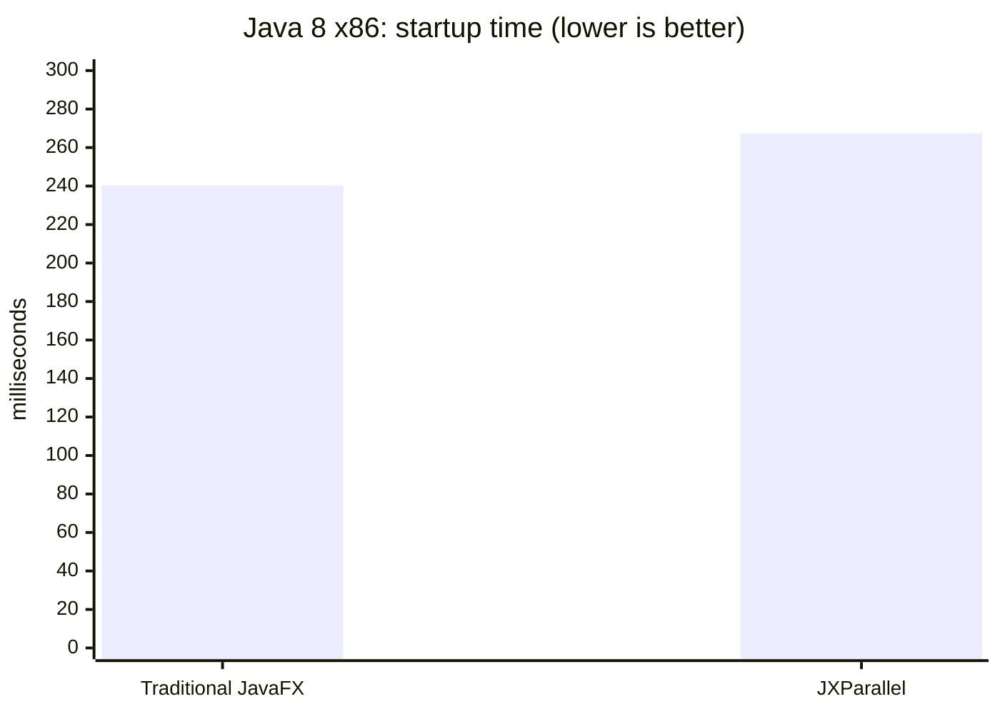
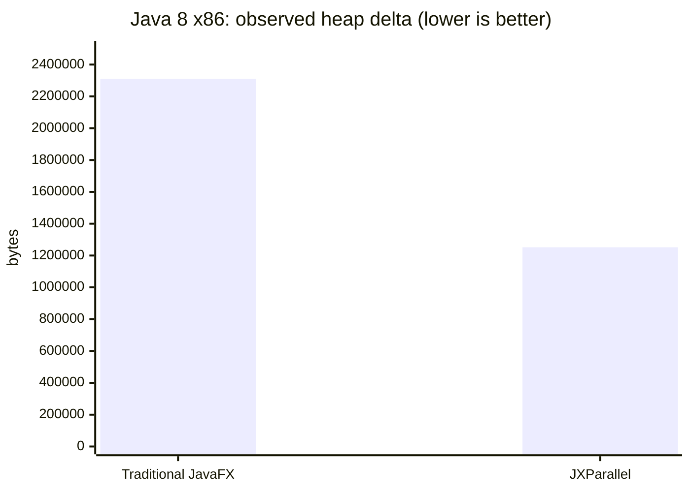
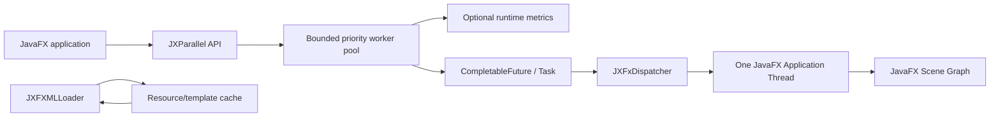

# JXParallel

## JavaFX-compatible runtime for safer parallel work

> **Same API. Same concepts. Better internals.**

JXParallel is an open-source, modular runtime for Java and JavaFX applications. It provides
bounded background execution, adaptive worker management, explicit JavaFX-thread dispatch,
lightweight properties and events, configurable FXML caching, and JavaFX-compatible controls.

The project is designed for teams that already know JavaFX and want to introduce safer
concurrency and resource management without replacing the development model they already use.

> **Migration status:** the new native UI foundation is independent of JavaFX, but the complete
> control, input, CSS, accessibility, and animation refactor is still in progress. Existing
> JavaFX-backed controls are legacy code and are not part of the native runtime.

## Why JXParallel?

JavaFX applications commonly need to coordinate two different execution domains:

```text
Background work
      |
      v
JXParallel bounded scheduler
      |
      v
JXFxDispatcher
      |
      v
One JavaFX Application Thread
      |
      v
Scene Graph
```

The native JXParallel UI does not create JavaFX Application Threads. It parallelizes work that
can run away from the native scene graph and makes rendering invalidation explicit.

JavaFX integration is now a separate legacy compatibility module. It is not required by
`jxparallel-core` or the new `jxparallel-ui` module.

## Features

- JavaFX-inspired task, property, event, collection, and control APIs
- bounded priority queue with backpressure
- dirty-layout caching and bounded resource memory
- shared animation scheduling instead of one thread per animation manager
- `BLOCK`, `REJECT`, `DISCARD`, and `DISCARD_OLDEST` queue policies
- configurable minimum and maximum worker counts
- cancellation tokens and enforced task timeouts
- lifecycle operations: `start`, `shutdown`, `shutdownNow`, and restart after shutdown
- optional runtime metrics with zero counter updates when disabled
- safe property binding lifecycle with `unbind()`
- stable snapshots for concurrent observable-list consumers
- JavaFX dispatcher that fails explicitly when the toolkit is unavailable
- asynchronous FXML loading with `NONE`, `LRU`, `TTL`, and `LRU_TTL` cache strategies
- independent Java2D/AWT scene foundation and renderer
- independent native window lifecycle
- native declarative layouts and initial controls
- optional modern variants, density, focus, hover, and fade-in styling
- independent experimental declarative UI model
- JUnit 4, JUnit 5, Mockito, PowerMock, JMH, and example modules

## Project status

| Area | Status |
|---|---|
| Core scheduler and lifecycle | Stable foundation |
| Properties, events, and collections | Implemented and tested |
| JavaFX dispatcher | Implemented; toolkit integration remains platform-dependent |
| JavaFX-compatible controls | `PARTIAL` |
| FXML loader and cache | `EXPERIMENTAL` |
| Modern visual layer | Implemented as an additive JavaFX layer |
| Independent renderer | Not implemented |
| Full accessibility and CSS replacement | Not implemented |
| Production-scale stress and leak suites | Planned |

The project prioritizes compatibility and correctness before micro-optimizations.

Scalability is implemented through bounded queues, lazy work, cached layout measurements,
bounded resource memory, stable snapshots, and shared schedulers. It is not based on creating
unbounded threads or retaining unlimited scene data.

## Quick start

### Background work and UI dispatch

```java
import com.jxparallel.core.JXParallel;
import com.jxparallel.javafx.JXFxDispatcher;

JXParallel.start();

JXParallel.background(() -> repository.loadCustomers())
    .thenAccept(customers ->
        JXFxDispatcher.runLater(() -> table.setItems(customers))
    )
    .exceptionally(error -> {
        JXFxDispatcher.runLater(() -> showError(error));
        return null;
    });
```

The rule is simple:

```text
I/O, parsing, computation      -> JXParallel.background(...)
Scene graph mutation            -> JXFxDispatcher.runLater(...)
```

### Native control model

```java
JXButton save = new JXButton("Save");
save.setOnAction(() -> saveDocument());

JXWindow window = new JXWindow("Editor");
JXPane content = new JXPane(12);
content.add(save);
window.setContent(content.render());
window.show();
```

The native model is independent of JavaFX. The JavaFX-like surface is being rebuilt on top of
native state rather than wrapping JavaFX controls.

```java
JXElement.of("button",
    JXProps.builder()
        .set("label", "Continue")
        .set("disabled", true)
        .build());
```

### Properties and binding lifecycle

```java
JXProperty<String> source = new JXProperty<>("initial");
JXProperty<String> target = new JXProperty<>();

target.bind(source);
source.set("updated");

// Release the listener when the view/controller is disposed.
target.unbind();
```

### Enforced timeout and cancellation

```java
Task<String> task = Task.of(() -> remoteService.fetch())
    .withTimeout(5, TimeUnit.SECONDS)
    .withPriority(TaskPriority.HIGH);

task.submit()
    .thenAccept(this::renderResult)
    .exceptionally(this::renderFailure);
```

Timeout completion is exceptional and interrupts the active worker. Task code should still
cooperate with interruption and release its own resources.

## Backpressure configuration

```java
JXParallelConfig config = JXParallelConfig.builder()
    .minThreads(2)
    .maxThreads(8)
    .autoScale(true)
    .queueCapacity(500)
    .queuePolicy(QueuePolicy.BLOCK)
    .metricsEnabled(true)
    .build();

JXParallel.applyConfiguration(config);
```

Equivalent `jx-parallel.config`:

```properties
threads.min=2
threads.max=8
threads.auto-scale=true
threads.daemon=true
queue.capacity=500
queue.policy=BLOCK
metrics.enabled=true
debug=false
```

Configuration precedence:

```text
built-in defaults
    < jx-parallel.config
    < environment variables
    < Java system properties
    < programmatic configuration
```

Queue policies:

| Policy | Behavior |
|---|---|
| `BLOCK` | waits for worker or queue capacity |
| `REJECT` | completes the new future exceptionally |
| `DISCARD` | cancels the new task without executing it |
| `DISCARD_OLDEST` | removes the oldest queued task and accepts the new one when possible |

## FXML cache

JXParallel caches resource bytes rather than sharing `Node` instances between scene graphs:

```java
FXMLLoaderService loader = new FXMLLoaderService();

loader.loadAsync("/views/home.fxml")
    .thenAccept(root -> JXFxDispatcher.runLater(() -> scene.setRoot(root)));
```

Supported strategies:

```properties
fxml.cache.enabled=true
fxml.cache.strategy=LRU
fxml.cache.max-size=100
fxml.cache.ttl=30m
```

Each load creates a new UI instance. Controllers and mutable scene-graph state are not shared
through the resource cache.

## Performance snapshot

Performance claims must be tied to a specific JDK, JavaFX runtime, architecture, display, and
workload. The following data is a real Java 8 32-bit GUI comparison, not a universal benchmark.

### Java 8 x86 GUI workload

Environment:

```text
JDK:     C:\Program Files (x86)\Java\jdk1.8.0_51
VM:      Java HotSpot Client VM 1.8.0_51
JavaFX:  JavaFX 8 from jfxrt.jar
Runs:    5 independent process runs per implementation
Flow:    create scene -> show stage -> click -> wait 50 ms -> update label
```





| Metric | Traditional JavaFX | JXParallel | Difference |
|---|---:|---:|---:|
| Startup to `Stage.show()` | 240.282 ms | 267.408 ms | JXParallel +11.3% |
| Click to visible result | 51.134 ms | 54.725 ms | JXParallel +7.0% |
| Observed heap delta | 2,309,547 bytes | 1,251,810 bytes | JXParallel -45.8% |
| Process CPU | 328.125 ms | 378.125 ms | JXParallel +15.2% |
| Thread-count delta | +1 | +1 | equal |

Interpretation: this small GUI workload shows lower observed heap delta for JXParallel, but
traditional JavaFX is faster in startup, click latency, and CPU. The current controls still
use JavaFX nodes and therefore do not claim an independent scene-graph memory or rendering win.

More measurements and limitations:

- [Java 8 x86 report](docs/metrics-java8-x86-report.md)
- [Benchmark methodology](docs/metrics-comparison.md)
- [Raw Java 8 x86 data](docs/metrics-java8-x86-2026-09-22.csv)

### Runtime benchmark direction

The benchmark module measures scheduler completion, independent tree mounting, CPU, wall time,
and observed heap delta:

```powershell
mvn -pl jxparallel-benchmarks -am clean package
java -cp "jxparallel-benchmarks\target\classes;jxparallel-core\target\classes" `
  com.jxparallel.benchmarks.RuntimeComparisonRunner
```

Do not use a single benchmark run to claim general superiority. The workload and configuration
must match the application being optimized.

## Architecture



Core design rules:

1. never create multiple JavaFX Application Threads
2. keep the core independent from JavaFX where possible
3. bound queues and make overload behavior explicit
4. preserve JavaFX concepts before optimizing internals
5. never share mutable `Node` instances through FXML cache entries
6. measure before calling a component lightweight or faster

## Modules

```text
jxparallel-core
  scheduler, tasks, configuration, properties, events, collections, declarative UI model

jxparallel-javafx
  legacy optional JavaFX adapter; excluded from the native build

jxparallel-fxml
  legacy optional JavaFX FXML adapter; excluded from the native build

jxparallel-junit4
jxparallel-junit5
jxparallel-mockito
jxparallel-powermock
  optional test integrations

jxparallel-benchmarks
  JMH and runtime comparison runners

jxparallel-examples-native
  executable Java2D example without JavaFX

jxparallel-examples
  legacy JavaFX comparison applications; excluded from the native build
```

The default reactor has no OpenJFX dependency:

```powershell
mvn -q test
```

The legacy adapter is only built explicitly:

```powershell
mvn -Plegacy-javafx -q test
```

## Build and test

The development reactor is verified with Maven and Java 21:

```powershell
cd C:\dev\JXParallel
mvn -q test
```

Build a package:

```powershell
mvn clean package
```

The core targets Java 8 source compatibility. The current JavaFX dependency profile uses OpenJFX
21 and therefore requires a newer JDK for JavaFX-dependent modules. Java 8 x86 GUI validation is
performed separately with JavaFX 8.

The native build matrix is:

| Runtime | Scope |
|---|---|
| Java 8 | `core`, `ui`, and native examples |
| Java 11 | complete default reactor |
| Java 17 | complete default reactor and Windows CI |
| Java 21 | complete default reactor |

JavaFX remains optional and is tested separately with `-Plegacy-javafx`.

## Compatibility

| Component or subsystem | Level |
|---|---|
| Core scheduler lifecycle | `FULL` for the documented JXParallel contract |
| Native Java2D foundation | `EXPERIMENTAL` |
| JavaFX compatibility module | `LEGACY / PARTIAL` |
| Native initial controls and layouts | `EXPERIMENTAL` |
| FXML loader and cache | `EXPERIMENTAL` |
| PowerMock adapter | `EXPERIMENTAL` |
| Independent renderer | `UNSUPPORTED` |

See [compatibility.md](docs/compatibility.md) for the complete matrix and migration boundaries.

The native architecture and migration rules are documented in
[native-ui.md](docs/native-ui.md).

## Documentation

- [Architecture](ARCHITECTURE.md)
- [Compatibility matrix](docs/compatibility.md)
- [Configuration](docs/configuration.md)
- [Modern UI layer](docs/modern-ui.md)
- [Declarative UI model](docs/ui-model.md)
- [Performance methodology](docs/metrics-comparison.md)
- [Java 8 32-bit comparison](docs/java8-32bit-comparison.md)
- [Scalability QA report](docs/qa-scalability-report.md)
- [Native UI progress](docs/native-ui-progress.md)
- [Roadmap](docs/roadmap.md)
- [Changelog](CHANGELOG.md)
- [Contributing](CONTRIBUTING.md)
- [Security policy](SECURITY.md)

## Contributing

Contributions should preserve the project priority order:

```text
Compatibility
    -> Correctness
        -> Stability
            -> Performance
                -> Micro-optimizations
```

Before adding an optimization, include:

- the JavaFX behavior being preserved
- the overhead being reduced
- a focused regression test
- a benchmark with the workload and runtime specified
- documentation for any compatibility difference

## License

JXParallel is released under the [MIT License](LICENSE).
