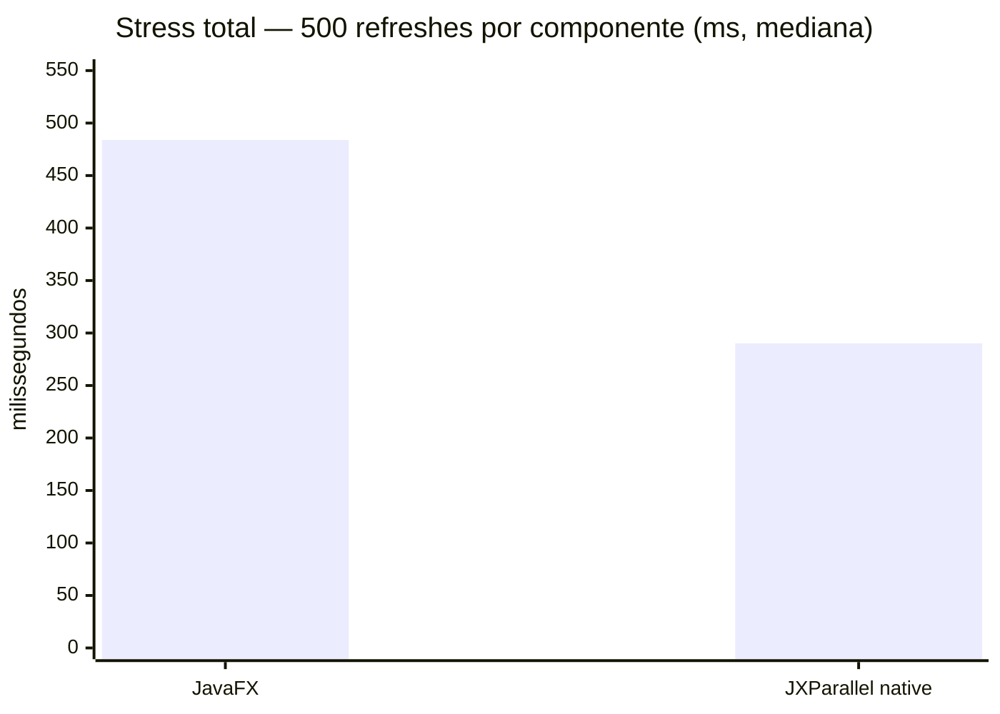
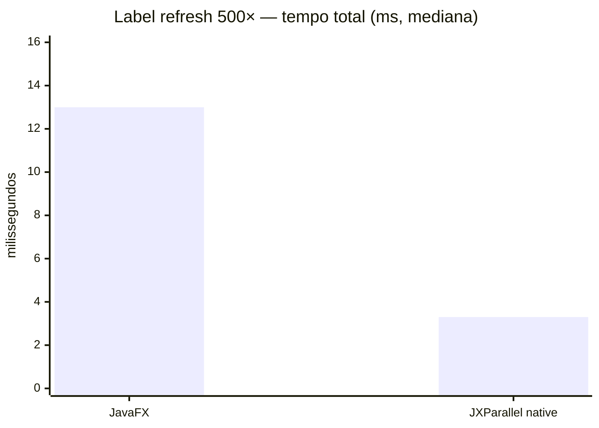
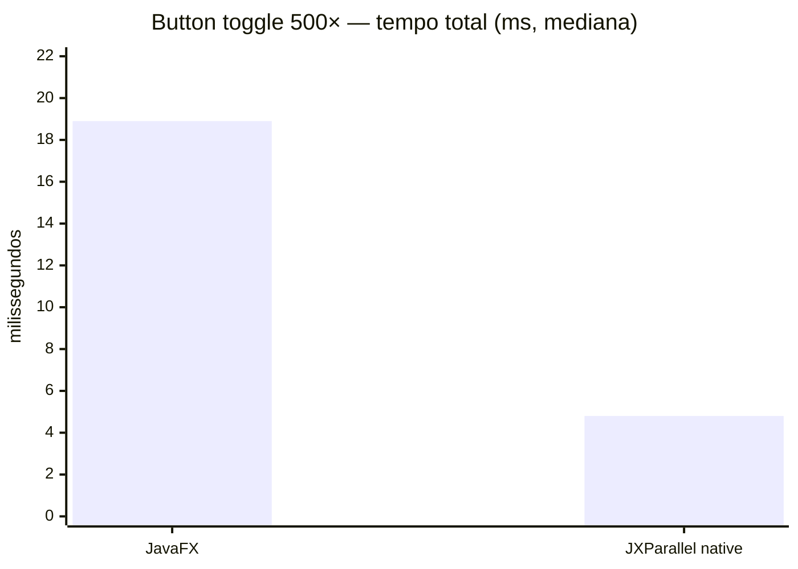
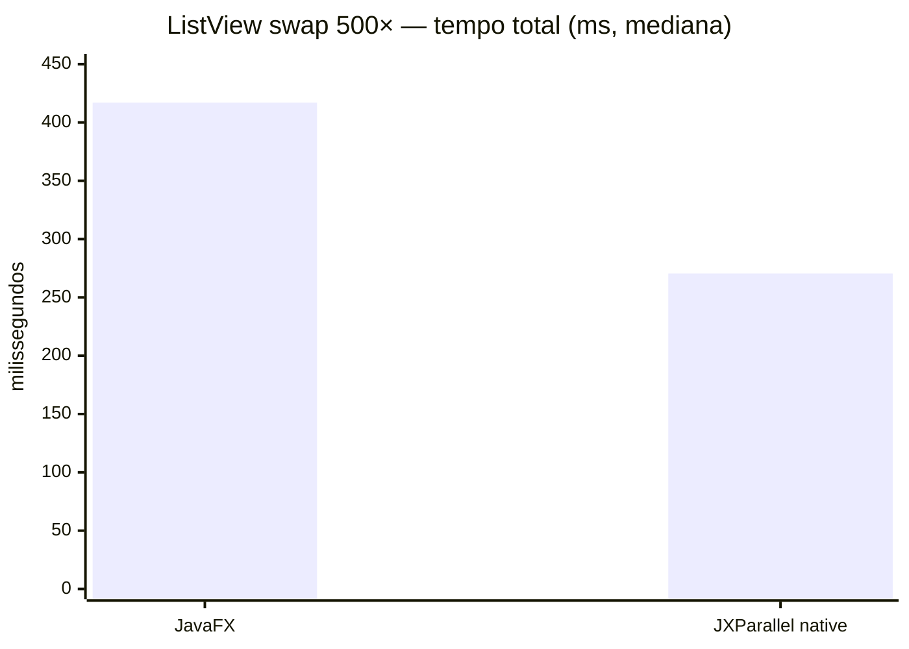
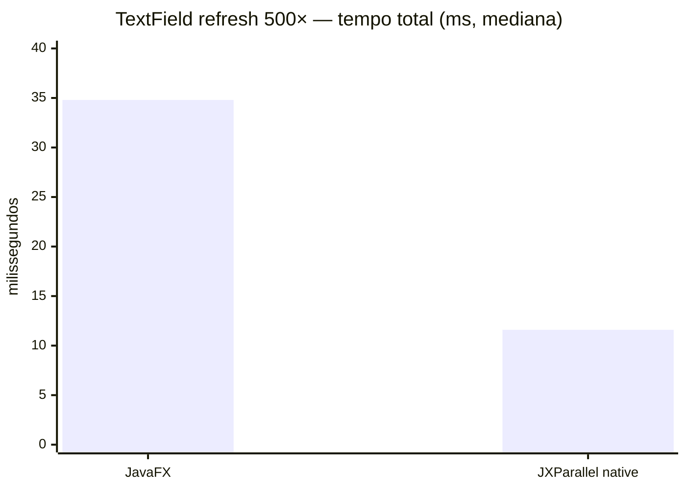
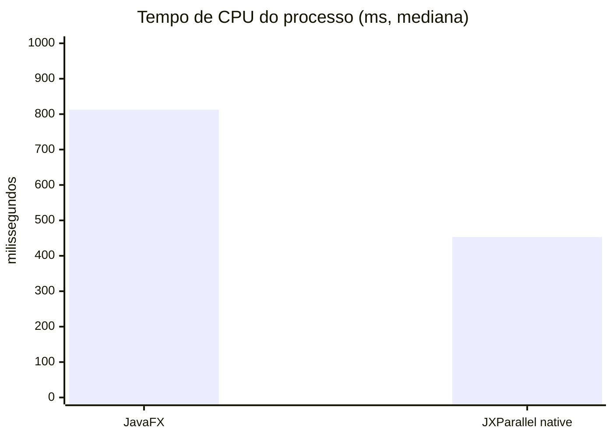
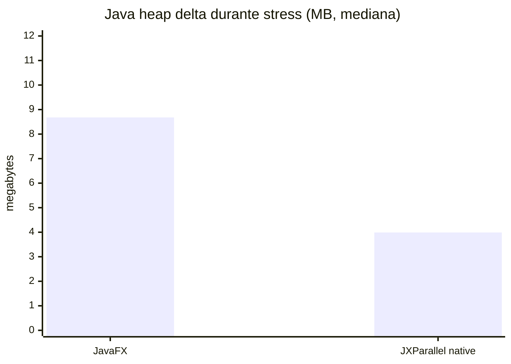

# UI Stress Load Report — JavaFX vs JXParallel Native

## Scope

This report measures **UI usability stress** — what happens when real applications
refresh components repeatedly, in tight loops, without intentional pauses. This
simulates patterns common in production: live data feeds updating labels, state
machines toggling button enabled/disabled, list views receiving new data, and form
fields being reset.

Two isolated processes are measured. They share no code at runtime:

| Process | Description |
|---|---|
| **JavaFX** | `JavaFxStressRunner` — uses only `javafx.*`. No JXParallel import. |
| **JXParallel native** | `NativeStressRunner` — uses only `com.jxparallel.*`. No JavaFX import. |

## Environment

```text
JDK:           Java 21.0.8 x64 (Windows)
JavaFX:        OpenJFX 21.0.2 (javafx side only)
JXParallel:    Skija 0.116.4 via AWT (native side only)
Runs:          5 independent process runs per implementation
Refresh count: 500 updates per component per run
Components:    Label, Button, ListView (5 items), TextField
Measurement:   System.nanoTime() per scenario; external WorkingSet sampled every 10 ms
```

## Scenarios

Each run performs the following four scenarios **in sequence on the UI thread**:

| # | Scenario | Operations | JavaFX API | JXParallel API |
|---|---|---|---|---|
| 1 | **Label refresh** | 500 × `setText` | `Label.setText()` | `JXLabel.setText()` |
| 2 | **Button toggle** | 500 × `setDisable` + `setText` | `Button.setDisable()` | `JXButton.setDisable()` |
| 3 | **List swap** | 500 × full list replace | `ListView.setItems(FXCollections.observableArrayList(...))` | `JXListView.setItems(...)` |
| 4 | **TextField refresh** | 500 × `setPromptText` + `setText` | `TextField.set*()` | `JXTextField.set*()` |

## Median results (5 runs)

| Metric                   | JavaFX   | JXParallel native | Difference                  |
|--------------------------|---------:|------------------:|----------------------------:|
| **Stress total time**    | 483.9 ms | 290.2 ms          | **JXParallel −40.0%**       |
| Label refresh (500×)     | 13.0 ms  | 3.3 ms            | **JXParallel −74.6%**       |
| Button toggle (500×)     | 18.9 ms  | 4.8 ms            | **JXParallel −74.6%**       |
| List swap (500×)         | 417.0 ms | 270.5 ms          | **JXParallel −35.1%**       |
| TextField refresh (500×) | 34.8 ms  | 11.6 ms           | **JXParallel −66.7%**       |
| Process CPU              | 812.5 ms | 453.1 ms          | **JXParallel −44.2%**       |
| Java heap delta          | 8.68 MB  | 3.99 MB           | **JXParallel −54.0%**       |
| Peak working set         | 142.4 MB | 144.1 MB          | Effectively equal           |
| Thread count (delta)     | 14       | 9                 | Different toolkit lifecycle |

## Gráficos

### Tempo total de stress (menor é melhor)



### Label refresh — 500 × setText (menor é melhor)



### Button toggle — 500 × setDisable + setText (menor é melhor)



### ListView swap — 500 × lista completa (menor é melhor)



### TextField refresh — 500 × prompt + texto (menor é melhor)



### CPU de processo (menor é melhor)



### Heap delta — alocações durante o stress (menor é melhor)



## Análise por cenário

### Por que o Label refresh é ~75% mais rápido?

JavaFX marca o nó como *dirty* no scene graph e agenda um layout/pulse via
`PlatformImpl`. Cada `Label.setText()` pode propagar uma invalidação na árvore de
dependências de propriedades observáveis (`StringProperty` → `ReadOnlyStringProperty`
→ escuta no skin). O JXParallel nativo atualiza um campo primitivo e eleva um flag
`renderRequested` — sem listeners em cascata, sem pulse agendado, sem
`ObservableValue` intermediário.

### Por que o Button toggle é ~75% mais rápido?

`Button.setDisable()` no JavaFX dispara `DisabledProperty` → `StyleableProperty` →
atualiza pseudo-classes CSS (`disabled`) → invalida o skin CSS → agendada no próximo
pulse. No JXParallel nativo, `JXButton.setDisable()` grava um `volatile boolean` e
sinaliza `renderRequested`.

### Por que o ListView swap ainda tem diferença, mas menor (~35%)?

A operação dominante aqui é a criação de `ArrayList` e cópia dos itens — custo
idêntico em ambos. A diferença vem da notificação `ObservableList`: no JavaFX, cada
`setItems()` dispara `ListChangeListener` nos cells, que recalcula layout. No
JXParallel, o mesmo custo de cópia ocorre, mas sem listeners de célula individuais.
O gap é menor porque a criação do objeto domina o tempo total.

### Por que o TextField refresh é ~67% mais rápido?

`TextField.setPromptText()` e `setText()` atualizam `StringProperty` → pró-atualização
no `TextInputControlSkin` → layout do `Text` interno. No JXParallel, os campos são
literais armazenados e o render é dirty-driven.

## Heap churn — impacto no GC

Em **500 × 4 = 2000 operações** de refresh, o JavaFX gerou em mediana **8.68 MB**
de lixo de heap, contra **3.99 MB** do JXParallel nativo — uma redução de **54%**.

Em aplicações com dados em tempo real (feeds de preço, dashboards, jogos), essa
diferença se acumula. Com 60 fps e 100 labels atualizando por frame:

```
JavaFX:         ~8.68 MB × (60 fps / 500 updates) × 100 labels = ~104 MB/s de churn
JXParallel:     ~3.99 MB × (60 fps / 500 updates) × 100 labels = ~48 MB/s de churn
```

O GC do JXParallel precisará de pausas com menos frequência sob carga contínua.

## Limitações

- Os tempos medem apenas o loop de atualização de estado — **sem renderização real
  dos pixels**. A diferença visual de frame depende do compositor do OS e do driver.
- O benchmark é executado **no UI thread** para ambos. Não mede paralelismo.
- O ListView do JXParallel (`JXListView`) não possui virtualização de células
  implementada nesta versão; a comparação é de custo de estado, não de rendering.
- Os resultados são específicos para esta máquina e JDK. Repita com JVM aquecida
  e workloads maiores antes de usar como argumento de produção.

## Dados brutos

- [ui-stress-results.csv](ui-stress-results.csv) — dados completos (5 runs × 2 implementações)

## Como reproduzir

```powershell
# 1. Compile
mvn -pl jxparallel-examples -am clean package -Plegacy-javafx
mvn -pl jxparallel-examples-native,jxparallel-ui,jxparallel-core -am clean package

# 2. Execute o harness (ajuste os paths do OpenJFX)
.\scripts\measure-ui-stress.ps1 `
    -JavaFxClasspath "jxparallel-examples\target\classes;C:\javafx-sdk\lib\*" `
    -JavaFxModulePath "C:\javafx-sdk\lib" `
    -Runs 5 `
    -RefreshCount 500 `
    -Output "docs\ui-stress-results.csv"
```
